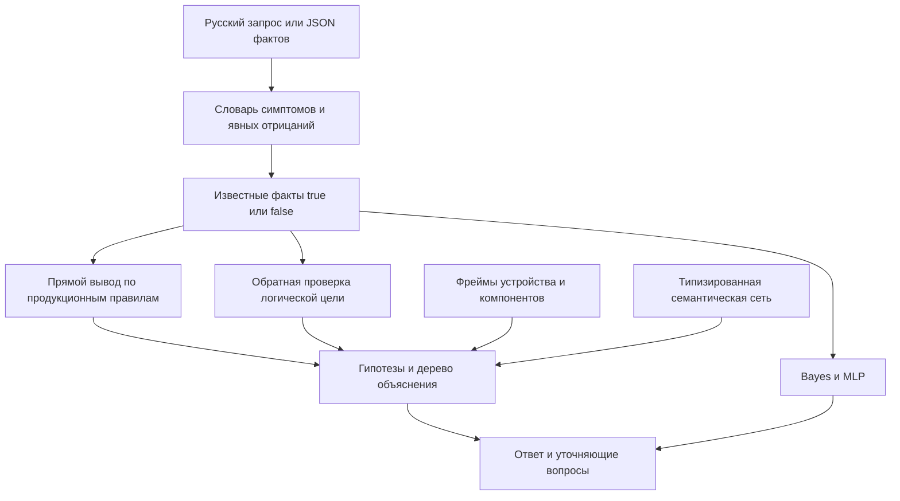
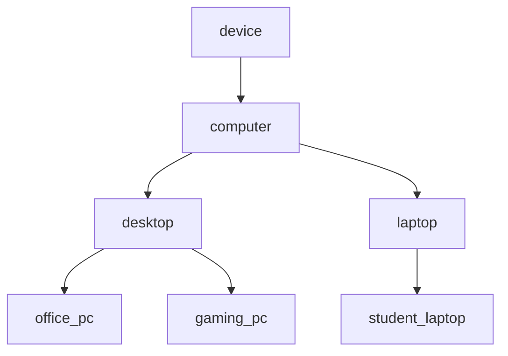
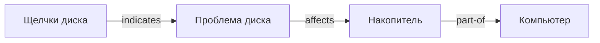

# Архитектура и алгоритмы

Программа объединяет символические знания и два обучаемых классификатора.
Основной результат консультации определяет вывод по правилам. Модели
дают отдельный учебный рейтинг, который пользователь может сопоставить
с объяснимой гипотезой.

## Поток запроса

`knowledge.json` — единый источник словаря, правил, гипотез, фреймов
и исходного графа. Данные обучения и веса хранятся отдельно.

## Логическая модель

Атом — именованное высказывание о наблюдаемом симптоме, например
`high_temp`. Известному атому соответствует `True` или `False`,
неизвестному — `None`. Приоритет операций: NOT, AND, OR.
Парсер поддерживает скобки и не выполняет пользовательский код.

| Операция | Правило для неизвестного U |
|---|---|
| NOT U | U |
| False AND U | False |
| True AND U | U |
| True OR U | True |
| False OR U | U |

Правила имеют вид `условие => положительное заключение`.
Обратный вывод проверяет, можно ли доказать выбранную цель. Для
каждого правила этой цели он проверяет посылки рекурсивно. Множество
посещённых целей прерывает положительные циклы. Неуспех доказательства
возвращает неизвестное значение; это не доказательство отрицания цели.

## Продукционный вывод

1. Рабочая память получает копию фактов пользователя.
2. Правила сортируются по убыванию приоритета, затем по ID.
3. При истинном условии новое заключение добавляется в рабочую память.
4. Повторяются проходы, пока больше нет новых фактов.

Заключение добавляется только один раз. Количество новых фактов
ограничено числом разных заключений, поэтому процедура завершается.
NOT над выводимым фактом запрещён при загрузке правил: иначе позднее
добавление факта могло бы опровергнуть уже сработавшее условие.
Явное противоречие заключению вызывает ошибку вместо скрытой замены.

В трассе сохранены правило, условие, шаг, заключение и посылки.
Для OR объясняется одна подтверждённая ветвь. Рекурсивное раскрытие
посылок строит дерево до исходных наблюдений.

## Фреймы

В диаграмме стрелка направлена от родителя к потомку; поле `parent`
в JSON указывает обратно на родителя. `describe` объединяет слоты
от корня к экземпляру, затем применяет локальные переопределения.
Поле `origins` показывает, от какого фрейма получено каждое значение.
Изменение экземпляра не меняет родительские слоты. Цикл наследования
и отсутствующий родитель вызывают ошибку.

## Семантическая сеть

Узлы имеют ID и подпись. Каждое ребро хранится как `[источник,
отношение, цель]`. Используются `is-a`, `part-of`, `affects`,
`indicates`, `runs`, `connected-to`.

BFS хранит очередь узлов с пройденным путём и множество посещённых
узлов. Первый найденный путь кратчайший по числу рёбер. Длина пути
не означает силу диагностического доказательства. Отдельный запрос
показывает связанные объекты в пределах заданной глубины.

## Классификаторы

Bernoulli Naive Bayes обучает априорные вероятности классов и
вероятности бинарных признаков со сглаживанием Лапласа. Предполагается
условная независимость признаков. Неизвестные признаки исключаются
из суммы логарифмов правдоподобия.

MLP вычисляет `softmax(tanh(XW1+b1)W2+b2)`. Вход масштабируется
из [0,1] в [-1,1]. Градиенты кросс-энтропии реализованы вручную
на NumPy. В 10% позиций обучающего батча подставляется 0,5,
что моделирует неполные наблюдения. Выбор весов использует только
validation. Test служит итоговой оценке. Веса записываются в JSON.

Обе модели предполагают один класс в одном примере. Правила могут
вывести несколько гипотез. Модельный рейтинг не отменяет вывод правил.
Для применения к реальной диагностике потребуется реальный размеченный
датасет и отдельная оценка качества на нём.

## Хранение и воспроизводимость

База знаний и обученные веса входят в Git. Локальные изменения фреймов
и сети хранятся в `.state/` и не публикуются. Запись использует
временный файл в той же директории и атомарный `os.replace`.
У датасета есть SHA-256, параметры генерации, группы и явная метка split.
Seed генератора и обучения — 42. Тесты проверяют сохранённые веса
и отсутствие одинаковых векторов в разных частях выборки.
